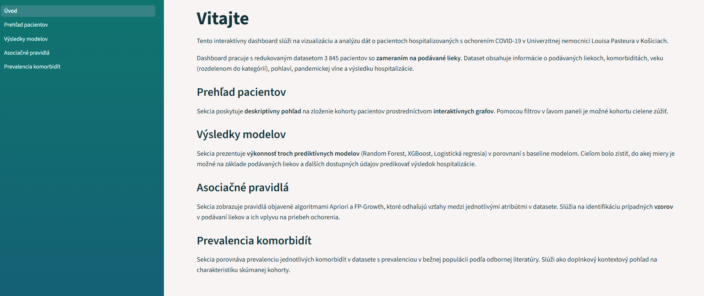
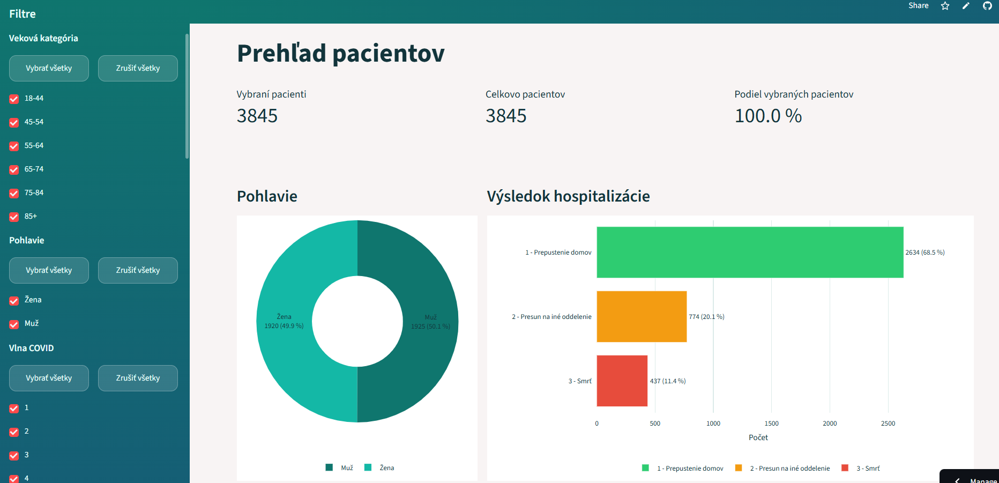
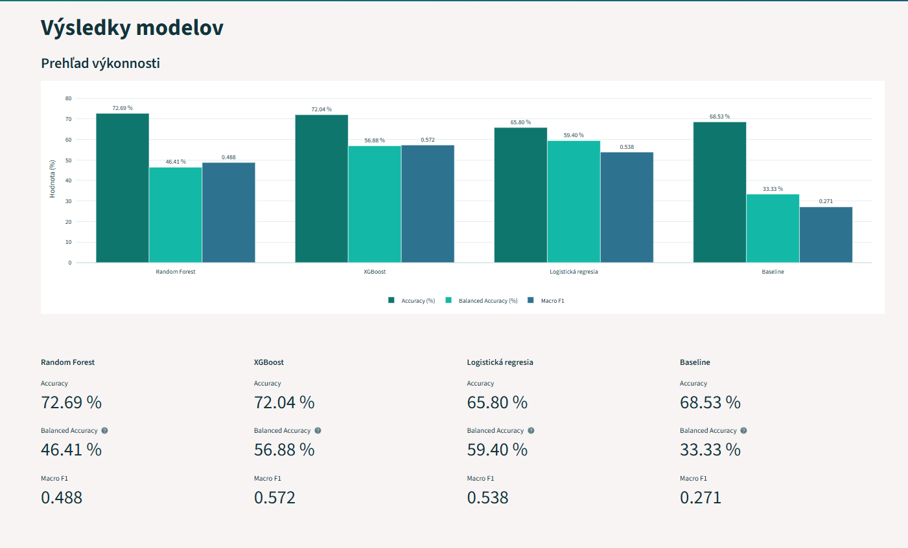
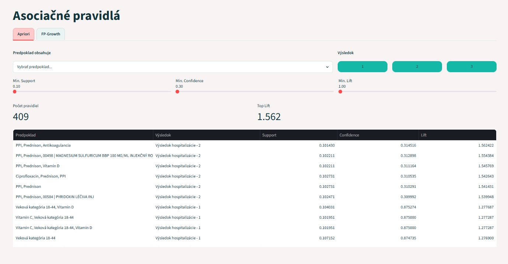
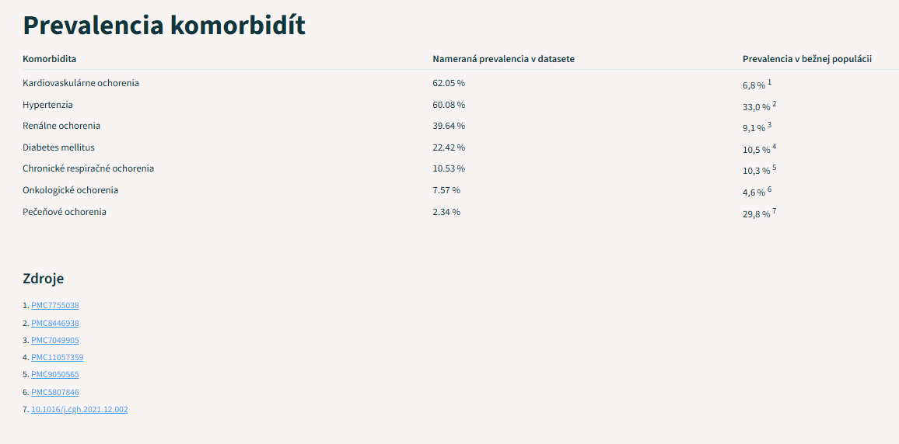

# Používateľská príručka — COVID-19 Dashboard

## Prístup k aplikácii

Aplikácia je dostupná online na adrese: [https://mn-covid-dashboard.streamlit.app/](https://mn-covid-dashboard.streamlit.app/)

---

## Sekcie aplikácie

### Úvod

Úvodná stránka dashboardu poskytuje stručný popis aplikácie a prehľad dostupných sekcií. Dashboard pracuje s datasetom 3 845 pacientov so zameraním na podávané lieky. Dataset obsahuje informácie o podávaných liekoch, komorbiditách, vekových kategóriách, pohlaví, pandemickej vlne a výsledku hospitalizácie.

---

### Prehľad pacientov

Táto sekcia umožňuje zobraziť informácie o zvolenej kohorte pacientov definovanej pomocou filtrov v navigačnom paneli.

Na ľavej strane obrazovky sa nachádza navigačný panel s filtrami, ktoré umožňujú definovať kohortu pacientov zobrazovanú v sekcii Prehľad pacientov. Výber možností v rámci jednej kategórie filtrov je možné urýchliť tlačidlami **Vybrať všetky** alebo **Zrušiť všetky**.

Kategórie **Komorbidity** a **Lieky** sú predvolene bez zaškrtnutých možností — v takom prípade sa filter neuplatní a zobrazia sa záznamy všetkých pacientov. Zaškrtnutím konkrétnych možností je možné kohortu ďalej zúžiť. Pre tieto dve kategórie je možné zvoliť logiku filtrovania — **AND** alebo **OR**. Vysvetlenie oboch možností nájdete priamo v navigačnom paneli.

Vizualizácia sa automaticky prispôsobuje vybraným filtrom.

Každý graf je interaktívny — jednotlivé položky je možné skryť alebo znovu zobraziť kliknutím na príslušnú položku v legende. Dvojitým kliknutím na položku v legende sa zobrazí iba tá zvolená. Tieto akcie majú čisto vizuálny charakter a neovplyvňujú ostatné grafy ani výber pacientov — výber ovplyvňujú výlučne filtre v navigačnom paneli. Okrem toho je možné graf priblížiť, posúvať alebo uložiť ako obrázok do zariadenia.

---

### Výsledky modelov

Táto sekcia zobrazuje výsledky trénovania a vyhodnotenia prediktívnych modelov na datasete. Modely boli natrénované na 80 % dát a vyhodnotené na zvyšných 20 % (testovacej vzorke). Grafy sú taktiež interaktívne.

- **Prehľad výkonnosti** — porovnávací graf a detailné číselné hodnoty troch metrík (Accuracy, Balanced Accuracy, Macro F1) pre každý model: Random Forest, XGBoost, Logistickú regresiu a Baseline model.
- **Distribúcia pacientov v testovacej vzorke** — počty a percentuálne podiely pacientov podľa výsledku hospitalizácie v testovacej vzorke.
- **Confusion Matrix** — matica zámen pre každý model zobrazujúca, ako model klasifikoval pacientov do jednotlivých tried výsledku hospitalizácie (1 — Prepustenie domov, 2 — Presun na iné oddelenie, 3 — Smrť).

Balanced Accuracy predstavuje priemer presností klasifikácie pre každú triedu zvlášť, čím zohľadňuje nerovnomerné zastúpenie tried v datasete. Na rozdiel od bežnej presnosti (Accuracy), ktorá môže byť skresľujúca v prípade, keď jedna trieda výrazne prevažuje, Balanced Accuracy poskytuje vyváženejší pohľad na skutočnú výkonnosť modelu.

Baseline model slúži ako referenčný bod — vždy predikuje najčastejšiu triedu v trénovacej vzorke (výsledok hospitalizácie 1 — Prepustenie domov). Jeho výsledky umožňujú posúdiť, o koľko sú ostatné modely lepšie ako triviálne riešenie.

---

### Asociačné pravidlá

Táto sekcia zobrazuje asociačné pravidlá objavené v datasete pomocou dvoch algoritmov — **Apriori** a **FP-Growth** — medzi ktorými je možné prepínať záložkami v hornej časti stránky. Každé pravidlo má tvar *„ak pacient má X, potom výsledok hospitalizácie je 1/2/3"*, pričom X môže predstavovať kombináciu komorbidít, liekov, vekovej kategórie, pandemickej vlny alebo pohlavia.

Pravidlo je charakterizované troma metrikami: **Support** (relatívna početnosť výskytu pravidla v datasete), **Confidence** (pravdepodobnosť, že ak platí predpoklad, platí aj záver) a **Lift** (miera sily asociácie nad rámec náhody).

Zobrazené pravidlá je možné filtrovať nasledovnými spôsobmi:

- **Predpoklad obsahuje** — výber konkrétnych položiek (komorbidity, lieky, veková kategória, vlna, pohlavie), ktoré musí predpoklad pravidla obsahovať.
- **Výsledok** — tlačidlami 1, 2, 3 je možné zobraziť len pravidlá s konkrétnym výsledkom hospitalizácie. Predvolene sú zapnuté všetky tri.
- **Min. Support, Min. Confidence, Min. Lift** — sliderom je možné nastaviť minimálne prahové hodnoty jednotlivých metrík.

V hornej časti sú zobrazené celkový počet pravidiel a najvyššia hodnota Lift spĺňajúce zvolené kritériá. Výsledky sú predvolene zoradené zostupne podľa hodnoty Lift, pričom kliknutím na hlavičku stĺpca v tabuľke je možné zoradenie zmeniť.

---

### Prevalencia komorbidít

Táto sekcia zobrazuje porovnanie prevalencie jednotlivých komorbidít medzi pacientmi v datasete a bežnou populáciou. Hodnoty prevalencie v bežnej populácii sú prevzaté z odbornej literatúry, pričom zdroje sú uvedené priamo na stránke.

